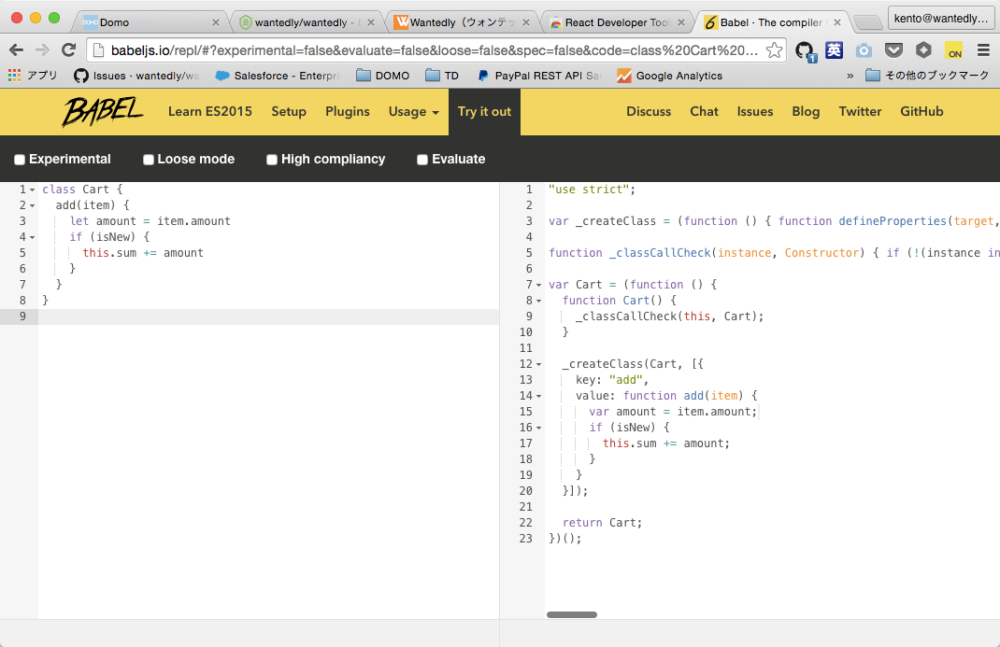

## ES2015

JavaScriptの新しいバージョン。
多くの機能が追加されて、気持ちよく使えるようになった。

## 新機能

多用する幾つかの機能を紹介する。

### let

変数を宣言するキーワード。以前から`var`が存在していたが、挙動がより明快なので`let`を使った方が分かりやすい。

```
// Before
var message = "Hello, world"
if (isOpen) {
  var message = "すでに開いています"
  alert(message) // "すでに開いています"と表示される
}
alert(message) // "すでに開いています"と表示される

// After
let message = "Hello, world"
if (isOpen) {
  let message = "すでに開いています"
  alert(message) // "すでに開いています"と表示される
}
alert(message) // "Hello, world"と表示される
```

`var`では、`if`文の中で宣言された変数でも、`if`文の外に影響を与えていたので、予期せず変数が上書きされる危険があった。
`let`を使えば、`if`文の中だけに閉じ込められた変数を宣言できるので、より安全にローカル変数を定義できる。

### Arrow function

無名関数をより簡単に定義するための機能。

```
// Before
this.message = "1秒後に実行"
setTimeout(function() {
  alert(this.message) // "undefined"が表示される。this.messageは存在しない。
}, 1000)

// After
this.message = "1秒後に実行"
setTimeout(() => {
  alert(this.message) // "1秒後に実行"が表示される。
}, 1000)
```

いちいち長い`function`というキーワードを書かずに良くなっただけではなく、`this`も固定化されているので不慮の事故を防ぐこともできる。

### Template String

文字列の中に変数を埋め込める。バックスラッシュ(\`) で囲んだ文字列の中では、変数を書くことができる。

```
let name = "World"
// Before
alert("Hello, " + name + "!") // Hello, World!

// After
alert(`Hello, ${name}!`) // Hello, World!
```


### Module

機能や部品ごとに、ファイルを分けるための仕組みが出来た。

外部のライブラリなどは、この仕組を使って作られていることが多く、Reactを用いた開発でも多用する。

#### Module定義

```
// foo.js
export function foo() {
  alert("Foo")
}
```

`export`キーワードを、外部に公開したいクラスや関数定義の前に書く。

#### Moduleの使用


```
// bar.js
import { foo } from './foo's

foo() // Alert "Foo"
```

`import`で、読み込みたいファイルと、その中で使いたいクラス・関数などを指定する。

### その他

他にも多くの機能が追加されている。下のリンクがよくまとまっているので、勉強にオススメ。

[http://babeljs.io/docs/learn-es2015/](http://babeljs.io/docs/learn-es2015/)

## Babel

ES2015は、最新の仕様であるため、その機能が全てのブラウザで動くとは限らない。
そのため、一般に公開するためには、古いブラウザでも動く形に変換する必要がある。

そのためのツールがBabelと呼ばれるもの。

実際にどのように変換されるかは、[http://babeljs.io/repl/](http://babeljs.io/repl/) でブラウザ上で確認することができる。JavaScriptに慣れている人は、色々試してみると勉強になる。

例えば、左のような`class`を使ったコードは、`class`を使わない右の書き方に変換される。


