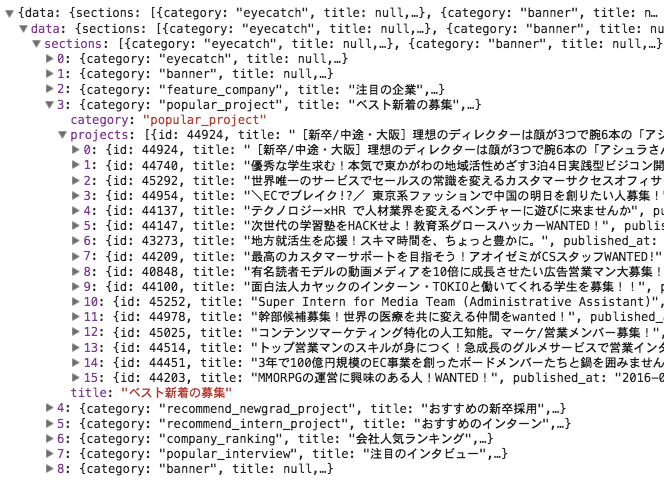

## API

表示に必要な募集等のデータを、APIから取得する。


## 用意したAPI

このインターンのために、以下のようなAPIを特別に用意した。

https://www.wantedlyapp.com/api/intern/portal

Basic認証: USERNAME=spring, PASSWORD=intern_2016

ブラウザからアクセスすると、JSONが返ってくることが確認できる。
APIの内容は以下のような形のJSON。



`data.sections[3]`がこの部分のデータを表している。


## APIの呼び方・受け取り方

`fetch(url, options)`関数を用いて、APIを呼ぶ `fetchPortalData()`を定義して、Componentが付けられた時点で呼ばれる`componentDidMount()`メソッド内で実行する。


```
componentDidMount() {
  this.fetchPortalData()
}

fetchPortalData() {
  // Create headers
  let headers = new Headers()
  headers.append('Authorization', `Basic ${btoa('spring:intern_2016')}`)
  // Call API
  fetch("https://www.wantedlyapp.com/api/intern/portal", { headers })
    .then((res) => {
      return res.json()
    })
    .then((json) => {
      console.log(json) // 受け取った内容がコンソールに出力される
      this.setState({
        data: json
      })
    })
}
```

`.then`という、パッと見て何が起きてるのか分かりにくいコードが多用されている。
これは、APIコールが終わって、レスポンスの取得が**完了したら次に〇〇する**、という非同期処理が発生するプログラムを綺麗に書くために編み出された`Promise`と呼ばれる書き方。

日本語に翻訳するとこんな感じ。

```
APIリクエストを送信する
  .それが完了したら次に({ レスポンスをJSONオブジェクトに変換し始める })
  .それが完了したら次に({ 結果をComponentの状態として保存する })
```

やってることは単純だが、理解するのにちょっと骨が折れるかもしれない。

## Async/Await

Promiseよりもっと分かりやすい方法として、ES2015では、Async/Awaitという概念が登場した。

これは、非同期な処理を同期的に書くための方法で、上のコードを書き換えると以下のようになる。

```
async fetchPortalData() {
  // Create headers
  let headers = new Headers()
  headers.append('Authorization', `Basic ${btoa('spring:intern_2016')}`)
  // Call API
  let res = await fetch("https://www.wantedlyapp.com/api/intern/portal", { headers })
  let json = await res.json()
  console.log(json) // 受け取った内容がコンソールに出力される
  this.setState({
    data: json
  })
}
```

関数宣言の前に`async`が追加されて、また`.then`がなくなった代わりに`await`というキーワードが追加されている。
`await`は、**完了するまで待つ** ことを表すキーワードで、これにより処理の流れが同期的に表せるようになって、直感的に読めるようになった。

これは日本語に訳すとこんな感じ。

```
APIリクエストを送信して、完了まで待つ
レスポンスをjsonオブジェクトに変換し始めて、完了まで待つ
結果をComponentの状態として保存する
```

Async/AwaitもPromiseの技術の上にできているので、Promiseを理解する必要はあるが、よりシンプルに使えるAsync/Awaitを積極的に使うことをオススメする。
