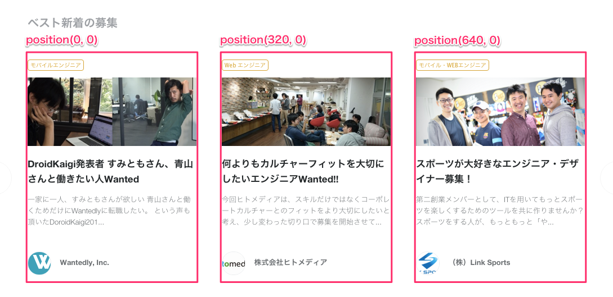

## State

Componentの状態をどのように定義して、どのように変化させるのかを学ぶ。
スライダーComponent(`PortalSlider`)を実装する。


## PortalSlider Componentの仕様

PortalSlider Componentを作る際に、どのように使うことを想定するか。
スライダー内の中身は、募集が入ったり、投稿や社員紹介が入ったりするので、汎用的に使えることを考えると、以下のように使えるものにしたい。

```
<PortalSlider>
  <PortalProject project={projects[0]} />
  <PortalProject project={projects[1]} />
  <PortalProject project={projects[2]} />
  ...
</PortalSlider>

<PortalSlider>
  <PortalPost post={posts[0]} />
  <PortalPost post={posts[1]} />
  <PortalPost post={posts[2]} />
  ...
</PortalSlider>
```

## スライダーが持つ状態

PortalSlider Componentはどういう状態を持つか考える。

持っている状態は、今何番目の要素を表示しているかという情報。

左端に何個目の要素を表示しているか(currentIndex)

初期状態では0で、">"をクリックすると3に、更に"<"をクリックすると0に戻る。

## 座標の指定

次にHTMLとCSSでどうやって表現するかを考える。

方法としては、各要素を表示する座標を計算する方法がある。
ページを送るごとに、各要素が表示されるべき場所を計算して、設定する。



CSSとしては、座標を設定する方法はいくつかあるが、パフォーマンスの面から`transform: translate(x, y)`プロパティを使用する。

## 大まかなComponent

コンポーネントの中の要素は、`this.props.children`として受け取ることができる。
Component定義の大枠はこんな感じ。

```
import React, { Component } from 'react'

export default PortalSlider extends Component {
  constructor(props) {
    super(props)
    this.state = { currentIndex: 0 }
  }

  calcStyle(index) {
    return {
      transform: `translate(${index * 320}px, 0)`
    }
  }

  render() {
    return <div>
      { this.props.children.map((child, index) => {
        return <div style={this.calcStyle(index - this.state.currentIndex)}>
          { child }
        </div>
      }) }
    </div>
  }
}
```


## 状態の変更

"次へ"と"前へ"ボタンを表示する

`src/PortalSlider.js`

```
export default class PortalSlider extends Component {
  render() {
    return (
      <div className={styles.base}>
        <a>前へ</a>
        <a>次へ/a>
        { this.props.children.map((child, index) => {
          return <div key={index}>{ child }</div>
        }) }
      </div>
    )
  }
}
```

初期状態を設定する

```
constructor(props) {
  super(props)
  this.state = {
    currentIndex: 0
  }
}
```

"次へ"と"前へ"ボタンを押した時にstateを変更する。

```
onClickPrev() {
  this.setState({ currentIndex: this.state.currentIndex - 3 })
}

onClickNext() {
  this.setState({ currentIndex: this.state.currentIndex + 3 })
}

render() {
  return (
    <div className={styles.base}>
      <a onClick={this.onClickPrev.bind(this)}>前へ</a>
      <a onClick={this.onClickNext.bind(this)}>次へ/a>
      { this.props.children.map((child, index) => {
        return <div key={index}>{ child }</div>
      }) }
    </div>
  )
}
```

状態から、位置を計算する。
位置はCSSの、`transform: translate(x, y)`プロパティを使って表現する。

```
calcStyleForIndex(index) {
  let position = index - this.state.currentIndex
  let style = {
    transform: `translate(${position * 320}px, 0)`
  }
  return style
}
```

```
{ this.props.children.map((child, index) => {
  return <div key={index} style={this.calcStyleForIndex(index)}>
    { child }
  </div>
}) }
```

Animationを付ける

```
transition: all 300ms ease;
```

## [練習]高度なアニメーション

例えば、以下のようなアニメーションはどうやって実装するか。


ヒント

`transition-delay`プロパティを仕様することで、アニメーションをずらすことができる。

答え

```
constructor(props) {
  super(props)

  this.state = {
    currentIndex: 0,
    perPage: 3,
    ltr: true, // Left to Right
  }
}

setCurrentIndex(index) {
  let nextIndex = [0, index, this.props.children.length - this.state.perPage].sort((a, b) => a - b)[1]
  this.setState({
    currentIndex: nextIndex,
    ltr: nextIndex >= this.state.currentIndex
  })
}

calcStyleForIndex(index) {
  let offset = index - this.state.currentIndex
  let style = {}
  style.transform = `translate(${offset * 320}px, 0)`
  if (offset >= 0 && offset < this.state.perPage) {
    let delay = (this.state.ltr ? offset : this.state.perPage - 1 - offset) * 100
    style.transitionDelay = `${delay}ms`
  }
  return style
}


```
